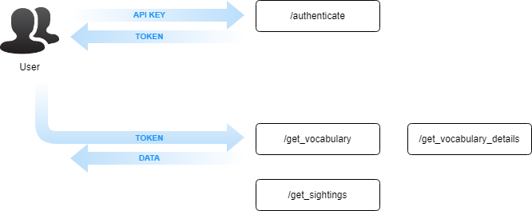

# API v4.0

## Overview

## Endpoints

### Authentication

- [authenticate](authenticate.md)

### Read Queries

- [/get_vocabulary](get_vocabulary.md)
- [/get_vocabulary_details](get_vocabulary_details.md)
- [/get_sightings](get_sightings.md)

## Changelog

- Authentication handshake phase added
- URL-based queries replaced with JSON input parameters
- Query caps vary depending on plan
