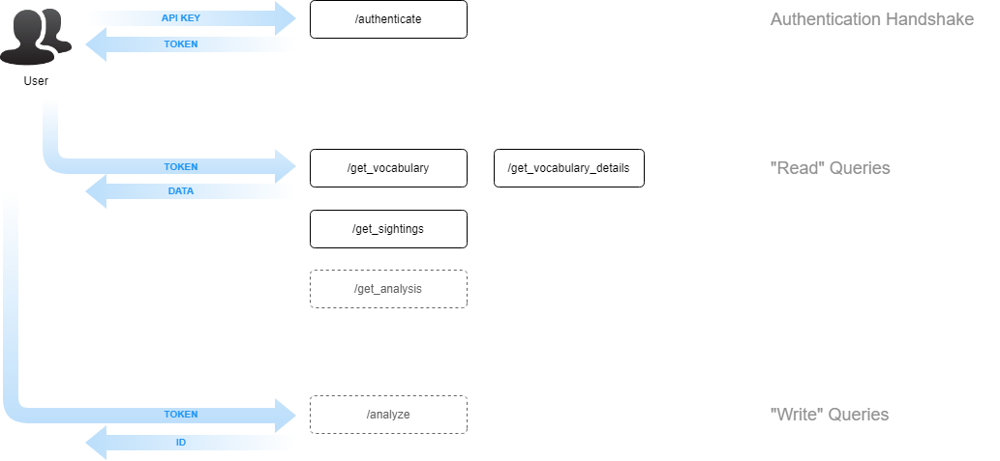

# API v4.1

## Overview

## Endpoints

### Authentication

- [authenticate](authenticate.md)

### Read Queries

- [/get_vocabulary](get_vocabulary.md)
- [/get_vocabulary_details](get_vocabulary_details.md)
- [/get_sightings](get_sightings.md)
- [/analyze](analyze.md)
- [/get_analysis](get_analysis.md)

## Changelog

- Addition of /analyze and /get_anaysis endpoints, allowing users to submit custom content to HateBrain
- Numerous enhancements to HateBrain, as described in the official [HateBrain Changelog](https://github.com/Hatebase/HateBrain-Changelog)
